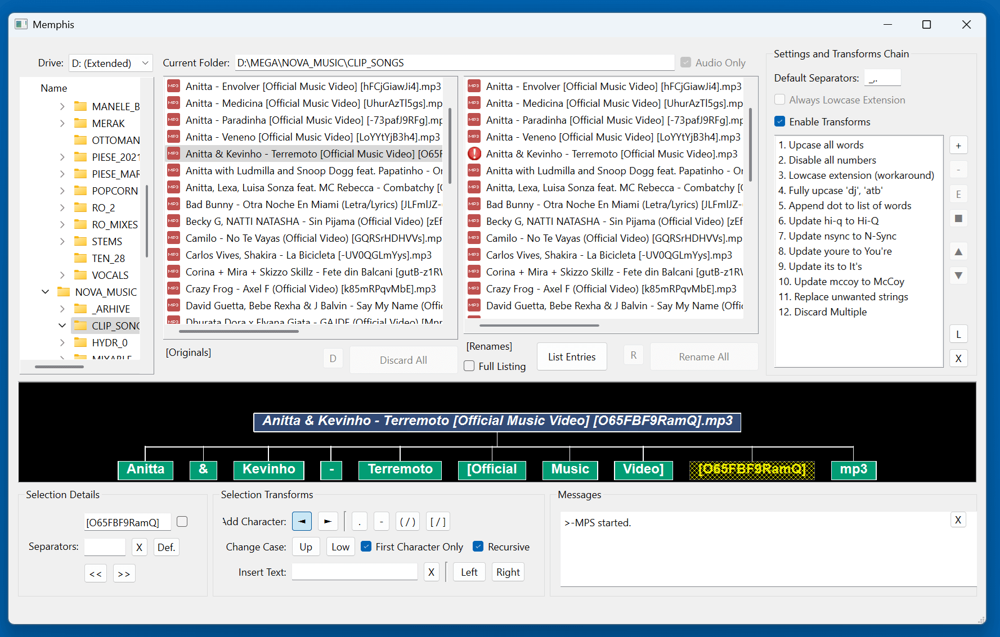

# README #

Visually rename your mp3 files. 

**WARNING:** *Use at your own risk*. 

I haven't taken the time to test all memory allocation issues, and there are quite some. That's because I'm using raw pointers. There, I've said it. Yes, I know there are smart pointers and I am planning on refactoring the app and use them. 

But until then, use at your own risk.

### Dependencies ###

* Qt-6.9.1
* boost_1_88_0

### Build Instructions ###

[Download Qt (for Windows)](https://www.qt.io/download-qt-installer-oss)
[Download boost](https://www.boost.org/releases/latest/)
[Configure boost_1.88 on Windows (for msvc)](https://www.realityframeworks.com/install-boost-on-windows-for-msvc-gcc/)
